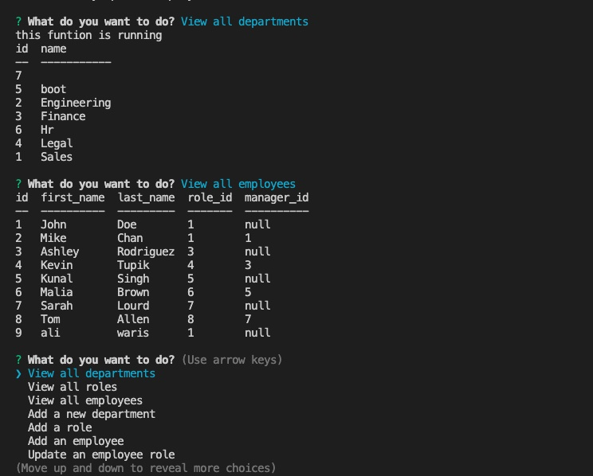

# MySQL-Employee-Team-Tracker

## Table of Contents

- [Description](#description)
- [Installation](#installation)
- [Usage](#usage)
- [Example](#examples)
- [Contact Information](#contact)

## Description

This application allows employers to manage their employees' information. They can search through employees by department or role. They can also add and remove employees, roles, and department.

## Installation

- open a terminal 
- node.js needs to be installed prior to use
- clone the repo: `https://github.com/zainuabidin/My-Employee-DataBase
- download npm JSON packages by entering `npm i or npm install`
- enter `node index` to start the index.js file
- follow prompts

## Usage

Answer the prompt questions: _ use arrows to move up or down and click enter to move to the next question._

```

GIVEN a command-line application that accepts user input
WHEN you start the application
THEN you are presented with the following options: view all departments, view all roles, view all employees, add a department, add a role, add an employee, and update an employee role
WHEN you choose to view all departments
THEN you are presented with a formatted table showing department names and department ids
WHEN you choose to view all roles
THEN you are presented with the job title, role id, the department that role belongs to, and the salary for that role
WHEN you choose to view all employees
THEN you are presented with a formatted table showing employee data, including employee ids, first names, last names, job titles, departments, salaries, and managers that the employees report to
WHEN you choose to add a department
THEN you are prompted to enter the name of the department and that department is added to the database
WHEN you choose to add a role
THEN you are prompted to enter the name, salary, and department for the role and that role is added to the database
WHEN you choose to add an employee
THEN you are prompted to enter the employee’s first name, last name, role, and manager, and that employee is added to the database
WHEN you choose to update an employee role
THEN you are prompted to select an employee to update and their new role and this information is updated in the database 

```

## Examples

Screenshot of Terminal:




[Employee Tracker Video Link](https://drive.google.com/file/d/1jzwIOWqAeZa9nw1ta9PnzrDoOCgJYSWf/view?usp=sharing)

## Contact

Email Address: xan.abdn@gmail.com

Linkedin Profile: [LinkedIn](https://www.linkedin.com/in/zain-abidin-a2923419a/)

Github: [Profile](https://github.com/zainuabidin)

Github: [Repo](https://github.com/zainuabidin/My-Employee-DataBase)